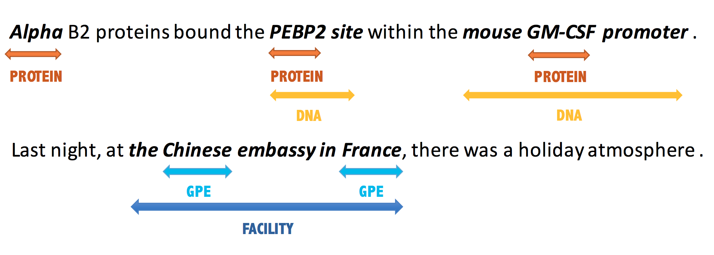

# A Unified MRC Framework for Named Entity Recognition 
The repository contains the code of the recent research advance in [Shannon.AI](http://www.shannonai.com). 

**A Unified MRC Framework for Named Entity Recognition** <br>
Preprint. [arXiv](https://arxiv.org/abs/1910.11476)<br>
**Authors:** Xiaoya Li\*, Jingrong Feng\*, Yuxian Meng, Qinghong Han, Fei Wu, Jiwei Li<br>
**BibTex:** 
```latex
@article{li2019unified,
  title={A Unified MRC Framework for Named Entity Recognition},
  author={Li, Xiaoya and Feng, Jingrong and Meng, Yuxian and Han, Qinghong and Wu, Fei and Li, Jiwei},
  journal={arXiv preprint arXiv:1910.11476},
  year={2019}
}
```
For any question, feel free to contact xiaoya_li@shannonai.com<br>



## Overview 

## Contents
1. [Data Preparation](#data-preparation)
1. [Dependencies](#dependencies)
2. [Usage](#usage)
3. [Results on Flat NER](#results-on-flat-ner)
4. [Results on Nest NER](#results-on-nest-ner)
5. [Updates](#updates)
6. [FAQ](#faq)


## Depndencies 

## Usage 

## Results on Flat NER 

## Results on Nested NER 


## Updates 
 

11/13/2019:
    1. init commit 

## FAQ